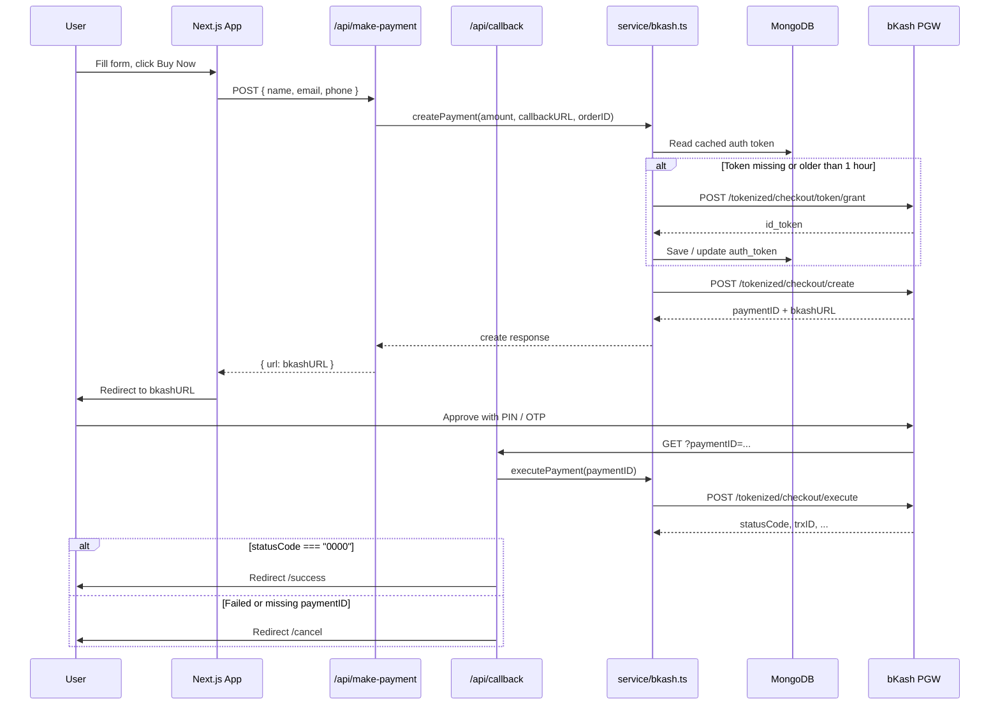

# bKash Payment Integration with Next.js

A Next.js demo app that accepts payments through the **bKash Tokenized Checkout** API. Users fill in buyer details on a product page, get redirected to bKash to approve the payment, then land on a success or cancel page.

---

## Tech Stack

| Layer | Technology |
|---|---|
| Framework | Next.js 15 (App Router) + React 19 |
| Language | TypeScript |
| Styling | Tailwind CSS |
| HTTP Client | Axios |
| Database | MongoDB (Mongoose) — stores bKash auth tokens |
| Payment | bKash Tokenized Checkout (PGW) |
| IDs | `uuid` for invoice / order numbers |

---

## Project Structure

```
bKash-with-nextjs/
├── app/
│   ├── page.tsx                 # Product page + buyer form + "Buy Now"
│   ├── layout.tsx               # Root layout
│   ├── globals.css              # Tailwind entry
│   ├── success/page.tsx         # Payment success UI
│   ├── cancel/page.tsx          # Payment cancelled / failed UI
│   └── api/
│       ├── make-payment/route.ts  # Creates bKash payment, returns bkashURL
│       └── callback/route.ts      # bKash redirect → execute payment
├── service/
│   └── bkash.ts                 # Grant token, create & execute payment
├── models/
│   └── bkashToken.ts            # Mongoose model for cached auth token
├── config/
│   └── bd.ts                    # MongoDB connection helper
├── public/
│   └── laptop.jpg               # Demo product image
└── .env.example                 # Required environment variables
```

---

## Features

- Product checkout page with name, email, and phone inputs
- Server-side bKash **grant token** (cached in MongoDB for ~1 hour)
- **Create Payment** via Tokenized Checkout
- Redirect to bKash hosted payment page
- **Callback** handler that runs **Execute Payment**
- Success and cancel result pages

> Not implemented yet: Query Payment, refunds, order persistence, or status verification beyond execute response.

---

## Environment Variables

Copy `.env.example` to `.env.local` and fill in values from the bKash Merchant Portal:

```env
BKASH_BASE_URL=
BKASH_CHECKOUT_URL_USER_NAME=
BKASH_CHECKOUT_URL_PASSWORD=
BKASH_CHECKOUT_URL_APP_KEY=
BKASH_CHECKOUT_URL_APP_SECRET=

MONGO_URI=
```

| Variable | Purpose |
|---|---|
| `BKASH_BASE_URL` | Sandbox or live Tokenized Checkout base URL |
| `BKASH_CHECKOUT_URL_USER_NAME` | Merchant username |
| `BKASH_CHECKOUT_URL_PASSWORD` | Merchant password |
| `BKASH_CHECKOUT_URL_APP_KEY` | App key (`x-app-key` header) |
| `BKASH_CHECKOUT_URL_APP_SECRET` | App secret (used when granting token) |
| `MONGO_URI` | MongoDB connection string for token cache |

Do not commit `.env.local`.

**Typical sandbox base URL:**

```text
https://tokenized.sandbox.bka.sh/v1.2.0-beta
```

---

## Payment Flow



### Step summary

1. User submits buyer details on `/`.
2. Frontend calls `POST /api/make-payment`.
3. Backend creates a payment (fixed amount **1000 BDT** in the current demo).
4. User is redirected to `bkashURL`.
5. After approval, bKash hits `GET /api/callback?paymentID=...`.
6. Backend executes the payment; on success → `/success`, otherwise → `/cancel`.

---

## Pages

| Path | File | Description |
|---|---|---|
| `/` | `app/page.tsx` | Demo MacBook product, form, Buy Now |
| `/success` | `app/success/page.tsx` | Shown after successful execute |
| `/cancel` | `app/cancel/page.tsx` | Shown when payment fails or is cancelled |

---

## API Routes

### `POST /api/make-payment`

**Body (JSON):**

```json
{
  "name": "string",
  "email": "string",
  "phone": "string"
}
```

**Behavior:**

- Builds callback URL from request `Origin`: `{origin}/api/callback`
- Generates a short order ID with `uuid`
- Amount is hardcoded to `1000`
- Calls `createPayment()` in `service/bkash.ts`
- Returns `{ message, url }` where `url` is bKash’s hosted checkout link

**Success response shape:**

```json
{
  "message": "Payment Success",
  "url": "https://..."
}
```

### `GET /api/callback`

**Query:**

| Param | Required | Description |
|---|---|---|
| `paymentID` | Yes | ID returned from Create Payment |

**Behavior:**

- Connects to MongoDB (for token reuse during execute)
- Calls `executePayment(paymentID)`
- Redirects to `/success` if `statusCode === "0000"`
- Redirects to `/cancel` if `paymentID` is missing or execute fails

---

## Core Service (`service/bkash.ts`)

| Function | Role |
|---|---|
| `createPayment` | Validates amount (≥ 1) and callback URL; calls Create Payment (`mode: 0011`, `currency: BDT`, `intent: sale`) |
| `executePayment` | Completes payment after user approval |
| `grantToken` | Returns cached token from MongoDB if still fresh (&lt; 1 hour), otherwise requests a new one |
| `setToken` | Calls Grant Token API and upserts `auth_token` in MongoDB |
| `authHeaders` | Sets `authorization` + `x-app-key` for Create / Execute |

### Token model (`models/bkashToken.ts`)

```ts
{
  auth_token: string;   // bKash id_token
  createdAt: Date;      // from timestamps
  updatedAt: Date;      // used for 1-hour expiry check
}
```

### Database (`config/bd.ts`)

`connectDb()` connects with `mongoose.connect(process.env.MONGO_URI)`.

Currently invoked at module load in `app/api/callback/route.ts`. In `make-payment`, the call is commented out — ensure MongoDB is connected before Create Payment if token grant must hit the DB.

---

## Setup & Run

```bash
git clone <repo-url>
cd bKash-with-nextjs
npm install
cp .env.example .env.local   # add bKash + MongoDB values
npm run dev
```

App runs at [http://localhost:3000](http://localhost:3000) (Turbopack enabled).

| Script | Command |
|---|---|
| Development | `npm run dev` |
| Production build | `npm run build` |
| Start production | `npm start` |
| Lint | `npm run lint` |

---

## Testing Notes

- Use **sandbox** credentials and test numbers from bKash.
- Callback must be reachable by bKash. Localhost alone is not enough for real redirects — use a tunnel (e.g. ngrok) or deploy a public HTTPS URL.
- Cover: successful pay, user cancel, and failed execute (`statusCode !== "0000"`).

---

## Deployment

1. Set all env vars on the host (e.g. Vercel).
2. Point `BKASH_BASE_URL` and credentials to **live** when going to production.
3. Callback URL is built from the request origin (`{origin}/api/callback`) — the deployed site must be HTTPS and publicly reachable.
4. Ensure `MONGO_URI` points to a production MongoDB instance.

---

## Troubleshooting

| Issue | Likely cause |
|---|---|
| Token / auth errors | Missing env vars, expired token, or MongoDB not connected so grant/cache fails |
| Redirect never returns | Callback URL not public / not HTTPS |
| Always lands on `/cancel` | Execute failed, missing `paymentID`, or `statusCode` not `"0000"` |
| Create payment fails with amount errors | Amount missing or less than 1 |

---

## References

- [bKash Developer Portal](https://developer.bka.sh)
- [Next.js Documentation](https://nextjs.org/docs)
- [Mongoose Documentation](https://mongoosejs.com/docs/)
