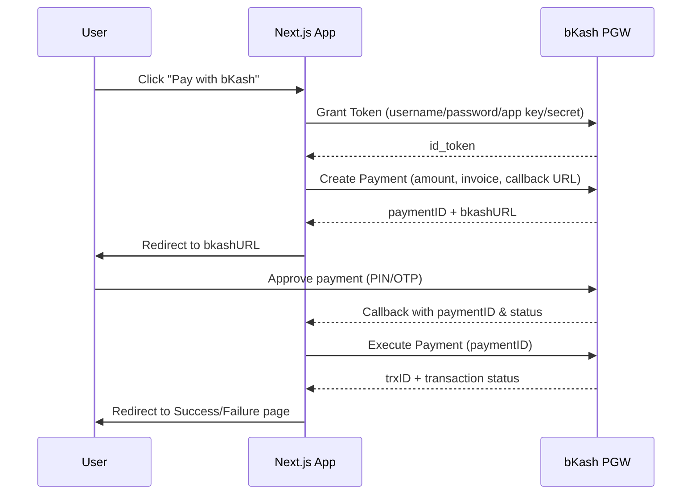

# Next.js bKash Payment Integration — Project Documentation

## 1. Overview
This project is a **Next.js** web application integrated with the **bKash Payment Gateway (PGW)** to allow users to make online payments through bKash. It covers authentication with bKash's Tokenized Checkout API, creating and executing payments, and handling callbacks/webhooks.

> Replace/expand any section below with the exact details of your implementation.

---

## 2. Tech Stack
| Layer | Technology |
|---|---|
| Frontend | Next.js (App Router / Pages Router — specify which) |
| Backend | Next.js API Routes / Route Handlers |
| Payment Gateway | bKash Tokenized Checkout (PGW) |
| Database | (e.g. MongoDB / PostgreSQL / MySQL — specify) |
| Auth | (e.g. NextAuth / JWT — specify) |
| Hosting | (e.g. Vercel / VPS — specify) |

---

## 3. Features
- User checkout flow with order summary
- bKash grant token generation (server-side)
- Create Payment request to bKash
- Execute Payment after user approval
- Payment status verification (Query Payment)
- Success / failure redirect handling
- Transaction logging in database
- Refund support (if implemented)

---

## 4. Environment Variables
Create a `.env.local` file with the following keys (values from bKash Merchant Portal):

```env
BKASH_BASE_URL=https://tokenized.pay.bka.sh/v1.2.0-beta   # sandbox or live
BKASH_USERNAME=
BKASH_PASSWORD=
BKASH_APP_KEY=
BKASH_APP_SECRET=
BKASH_CALLBACK_URL=https://yourdomain.com/api/bkash/callback
```

⚠️ Never commit `.env.local` to version control. Add it to `.gitignore`.

---

## 5. Payment Flow



---

## 6. API Routes

| Route | Method | Purpose |
|---|---|---|
| `/api/bkash/token` | POST | Get grant token from bKash |
| `/api/bkash/create-payment` | POST | Create a new payment session |
| `/api/bkash/execute-payment` | POST | Execute payment after approval |
| `/api/bkash/callback` | GET/POST | Handle bKash redirect callback |
| `/api/bkash/query-payment` | POST | Verify payment status by paymentID |
| `/api/bkash/refund` | POST | (Optional) Refund a transaction |

---

## 7. Database Schema (Example)

```ts
interface Transaction {
  _id: string;
  paymentID: string;
  trxID?: string;
  amount: number;
  currency: string;
  status: "PENDING" | "COMPLETED" | "FAILED" | "CANCELLED";
  customerMsisdn?: string;
  createdAt: Date;
  updatedAt: Date;
}
```

---

## 8. Setup & Installation

```bash
git clone <repo-url>
cd project-name
npm install
cp .env.example .env.local   # fill in bKash credentials
npm run dev
```

---

## 9. Testing
- Use bKash **Sandbox** credentials and test MSISDNs provided by bKash for development.
- Test happy path (successful payment), cancelled payment, and failed/expired payment scenarios.
- Verify amounts and invoice numbers match on the `Query Payment` response before marking an order as paid.

---

## 10. Deployment Notes
- Switch `BKASH_BASE_URL` and credentials to **live** values before production release.
- Ensure `BKASH_CALLBACK_URL` is a publicly accessible HTTPS URL.
- Set all environment variables in your hosting provider's dashboard (e.g. Vercel Project Settings).

---

## 11. Troubleshooting
| Issue | Likely Cause |
|---|---|
| `Invalid token` error | Grant token expired — regenerate before each Create Payment call |
| Callback not firing | Callback URL not publicly reachable / HTTPS missing |
| Amount mismatch | Currency/amount formatting issue (bKash expects string, 2 decimal places) |

---

## 12. References
- bKash Developer Portal: https://developer.bka.sh
- Next.js Documentation: https://nextjs.org/docs